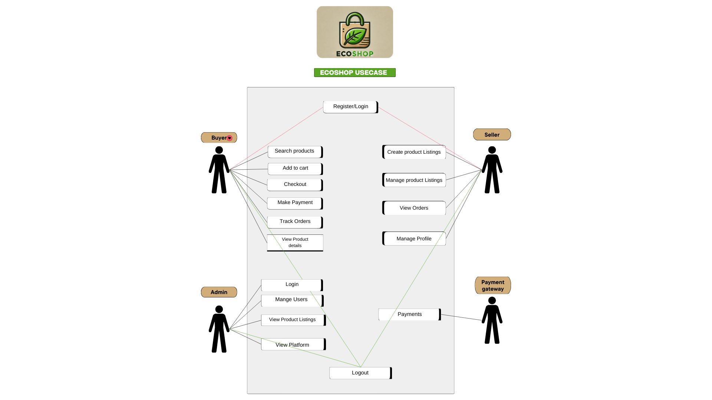

# Echo-Shop-Documentation

## Project Overview

EchoShop Platform is an online marketplace focusing on a specific niche: eco-friendly products, handmade goods, or second-hand electronics. The platform bridges buyers and sellers, empowering small entrepreneurs and catering to consumers who value sustainability and uniqueness. The niche focus ensures a well defined market, enabling better targeting and reduced competition compared to other general marketplaces.

## Core Features (Fundamental for MVP)

1. User Registration and Login (Authentication)
   - Allow users to register as buyers or sellers.
   - Include basic authentication (email and password).
   - Enable secure login with encrypted passwords.
   - Product Listings

2. Sellers can add, edit, and delete their product listings.
   - Each product includes:
   - Name, description, price, and category.
   - Photos (single or multiple).
   - Buyers can view product listings in categories.

3. Product Search and Filters
   - Basic search functionality to find products by name or keyword.
   - Filters for categories, price range, and availability.

4. Shopping Cart
   - Enable buyers to add products to a cart.
   - Display a summary of items in the cart with total price.

5. Checkout and Payment Integration
   - Implement a secure and reliable payment gateway (e.g., Stripe or PayPal).
   - Ensure buyers can make payments directly on the platform.

6. Order Management
   - Buyers can view their order history.
   - Sellers can see and manage orders (e.g., order status: pending, completed, canceled).

7. Basic Seller Dashboard
   - A simple dashboard where sellers can:
   - View their product listings.
   - See their sales/orders.

8. Homepage with Product Categories
   - A homepage displaying product categories and a selection of featured or new products.
   - Provide a simple navigation system for browsing.
 
9. Responsive Design
    - Ensure the platform is mobile-friendly and accessible on various devices (phones, tablets, desktops).

11. Basic Admin Panel, Admins can manage:
    - User accounts (e.g., deactivate or delete users).
    - Products (e.g., remove inappropriate listings).

## Why These Features Are Fundamental
  - Usability: Buyers and sellers can interact seamlessly with the platform (product browsing, selling, and purchasing).
  - Monetization: Payments are integrated, making the platform functional for transactions.
  - Scalability: The foundation is built so that additional features (like AI recommendations or premium seller accounts) can be added later.
  - Sellability: These features cover the essential needs of buyers and sellers, making the platform attractive to early users and potential investors.

## Features to Add Later

Once the MVP is live and feedback is gathered, you can expand with additional features like:
- AI-driven product recommendations.
- Premium accounts for sellers (to feature their products).
- Advanced analytics for sellers.
- Multi-language support.
- Social sharing options for products.

## Order of Development

1. Backend Foundation (Django Project Setup, Models, and APIs)
   - Set up the Django project structure.
   - Define the core models (e.g., Users, Products, Orders) and database schema.
   - Create basic RESTful APIs using Django REST Framework (DRF) for critical functionalities:
   - User registration and authentication.
   - CRUD operations for product listings.
   - Order creation and management.

2. Database Setup and Integration (MySQL Configuration)
   - Set up the MySQL database and connect it to Django.
   - Test database connections and validate the schema with mock data.
   - Ensure migrations and database operations are functional.

3. Frontend Basics (React Setup and Core Pages)
   * Initialize the React project and set up the structure.
   * Build static versions of core pages (e.g., Homepage, Login/Signup, Product Listings).
   * Configure React Router for navigation between pages.
   * Focus on creating mock pages first before integrating APIs.

4. Backend-Frontend API Integration
   - Connect the frontend with backend APIs to enable:
   - User authentication (login/signup).
   - Fetching and displaying product listings.
   - Adding products to the cart and managing orders.
   - Use tools like Axios or Fetch for API calls.

5. Core Features Implementation

Enable functionality for:
- User authentication (register, login, logout).
- Product listing management (CRUD for sellers, viewing for buyers).
- Order creation and management (e.g., order status, order history).
- Shopping cart functionality.
- Build and test these features incrementally to ensure they work together.

6. Payment Gateway Integration (Stripe or PayPal)
   - Set up payment processing for checkout.
   - Ensure secure handling of payment data (e.g., compliance with PCI standards).
   - Test the payment flow thoroughly (sandbox testing).

7. UI/UX Improvements (Styling and Responsiveness)
   - Apply consistent styling using CSS frameworks (e.g., Tailwind CSS, Material-UI).
   - Ensure the platform is fully responsive and works well on desktop, tablet, and mobile devices.
   - Optimize the user experience with intuitive navigation and interactions.

8. Testing and Quality Assurance
   - Unit Testing:
   - Test individual backend APIs and React components.
   - Integration Testing: 
   - Test the entire flow (e.g., logging in, adding a product to the cart, and completing checkout).
   - User Testing:
   - Have early users (beta testers) try the platform and provide feedback.
   - Fix any bugs or usability issues before launch.

10. Launch MVP (Host and Promote the Platform)
    - Deploy the backend on a cloud platform (e.g., AWS, Heroku, or DigitalOcean).
    - Host the front end on services like Vercel or Netlify.
    - Ensure all features are functional and secure.
    - Start marketing to your target audience to onboard your first users.
   
# Project Plan and Timeline
# Project Plan and Timeline

## Why This Order Works in Real-World Practice
- **Iterative Development**: Develop and test in small, manageable steps, ensuring each part works before moving on to the next.
- **Backend-First Approach**: Ensures the data layer is functional before building the frontend that interacts with it.
- **API Integration Before Full Styling**: Focus on functionality first, leaving UI/UX polish for later stages.
- **Early Testing**: Catch and resolve bugs early to save time and effort.
- **Payment Gateway Integration After Core Features**: Prioritize essential features like buying and selling before adding non-critical features.
- **Marketing and Feedback Loop**: Launch an MVP early to gather real user feedback, guiding future iterations.

---

## Timeline for 3.5 Months (Approx. 15 Weeks)

### Phase 1: Planning and Setup (Week 1–2)
#### Week 1:
- **Finalize MVP Requirements**:
  - Define key features and prioritize development scope.
- **Database Schema Design**:
  - Create an ER diagram for MySQL.
- **Wireframes/Mockups**:
  - Design key pages (e.g., homepage, product listing, checkout).
- **Development Environment Setup**:
  - Backend: Set up Django project.
  - Database: Configure MySQL.
  - Frontend: Initialize React project.

#### Week 2:
- **Backend Development**:
  - Set up Django project structure.
  - Implement basic models: `User`, `Product`, `Order`.
  - Create APIs for user authentication (register, login).
- **Frontend Development**:
  - Build static versions of key pages (homepage, login/signup, product listing).
  - Set up project structure.

---

### Phase 2: Backend and Frontend Integration (Week 3–5)
#### Week 3:
- **Backend Development**:
  - Add CRUD APIs for:
    - Product creation, update, delete (for sellers).
    - Product retrieval (for buyers).
  - Implement basic shopping cart functionality.
- **Frontend Development**:
  - Build the product listing page with API integration.
  - Develop and integrate user authentication (login/signup) with the backend.

#### Week 4:
- **Backend Development**:
  - Implement order creation and basic order management functionality.
- **Frontend Development**:
  - Create shopping cart functionality (add/remove items, display cart contents).
  - Integrate cart-related APIs with the backend.

#### Week 5:
- **Testing and Refinements**:
  - Perform integration testing for backend APIs and frontend.
  - Fix bugs and improve backend/frontend communication.
  - Refine product listing and shopping cart flows.

---

### Phase 3: Core Features Implementation (Week 6–8)
#### Week 6:
- **Backend Development**:
  - Implement seller dashboard API (to view and manage their product listings).
  - Develop buyer order history API.
- **Frontend Development**:
  - Build seller dashboard page.
  - Build order history page for buyers.

#### Week 7:
- **Payment Gateway**:
  - Integrate Stripe or PayPal for payment processing in the backend.
  - Develop a secure checkout flow (frontend and backend integration).
- **Frontend Development**:
  - Implement checkout page and integrate with the payment gateway.

#### Week 8:
- **Testing**:
  - Thorough testing of the checkout and payment flow.
  - Fix bugs related to orders and payments.
- **UI Improvements**:
  - Start styling key pages (basic responsiveness with Tailwind CSS or Material-UI).

---

### Phase 4: UI/UX and Polish (Week 9–11)
#### Week 9:
- **UI Enhancements**:
  - Polish the UI for:
    - Homepage with product categories.
    - Product details page.
    - Shopping cart and checkout.
  - Make the platform fully responsive for mobile and desktop devices.

#### Week 10:
- **Admin Panel**:
  - Add functionality for admins to:
    - Manage users (deactivate accounts).
    - Remove inappropriate product listings.
- **Beta Testing**:
  - Conduct user testing with a small group of beta testers.

#### Week 11:
- **Feedback and Iteration**:
  - Gather and analyze feedback from beta testers.
  - Fix usability issues or add small improvements.

---

### Phase 5: Final Testing and Deployment (Week 12–15)
#### Week 12:
- **Testing**:
  - Perform unit testing and integration testing for all features.
  - Conduct stress tests to ensure the platform can handle multiple users.

#### Week 13:
- **Deployment**:
  - Deploy backend (Django) on a cloud platform (AWS, Heroku, or DigitalOcean).
  - Deploy frontend (React) on Vercel or Netlify.
  - Perform end-to-end testing on the live environment.

#### Week 14:
- **Final Optimizations**:
  - Fix any remaining bugs.
  - Add performance optimizations and SEO improvements.

#### Week 15:
- **Launch**:
  - Officially launch the platform MVP.
  - Start marketing to your target audience and onboard your first users.

---

## Key Milestones
- **Week 5**: Basic platform with product listings and shopping cart.
- **Week 8**: Functional MVP with core features (orders and payments).
- **Week 11**: Polished platform ready for testing with real users.
- **Week 15**: Full deployment and public launch.

---

## MVP Feature List (Including Authentication)
### User Authentication:
- Register, log in, and log out.
- Password reset.
- Role-based access for buyers, sellers, and admins.
- Optional: Social login (e.g., Google, Facebook).

### User Profiles:
- **Buyers**: Manage profile and view order history.
- **Sellers**: Manage profile, product listings, and sales.
- **Admins**: Manage users, products, and disputes.

### Product Listings:
- Sellers can list products with details (name, price, condition, etc.).
- Buyers can search, filter, and view products.

### Shopping Cart & Checkout:
- Buyers can add items to the cart, checkout, and make payments.
- Secure payment gateway integration.

### Order Management:
- **Buyers**: Track orders.
- **Sellers**: View and update orders.

### Admin Panel:
- Monitor platform activity, users, and products.

### Ratings & Reviews (optional):
- Buyers can leave reviews for products.

---

## Why the MVP is Sellable
### Target Market Alignment:
By focusing on eco-friendly and second-hand products, you're entering a growing niche that aligns with current consumer values like sustainability and affordability.

### Solving Pain Points:
Platforms like eBay are general-purpose and often lack a focus on specific niches. Your platform’s focus on eco-conscious buyers creates an opportunity to attract a dedicated audience.

### Scalable Foundation:
By implementing fundamental features (authentication, product listings, checkout, etc.), you establish a strong foundation to build upon. Advanced features like AI recommendations or analytics can be added as the platform grows.

### Revenue Potential:
**Potential Monetization Options**:
- Seller fees: Charge sellers a commission per sale or for premium features like better visibility.
- Subscription plans: Offer premium plans for sellers to boost their products.
- Advertising: Allow sellers to advertise their products on the platform.

## Use Cases
### Actors:
- **Buyer**: A user who browses and purchases eco-friendly or second-hand products.
- **Seller**: A user who lists products for sale.
- **Admin**: A user who moderates the platform and manages users/products.
- **Payment Gateway (External System)**: Handles payment processing.

### Use Cases:
#### Buyer:
- Register/Login.
- Search and Browse Products.
- View Product Details.
- Add to Cart.
- Checkout and Make Payment.
- Track Orders.
- Leave Reviews/Ratings (Optional for MVP).

#### Seller:
- Register/Login.
- Create Product Listings.
- Manage Product Listings (Edit/Delete).
- View Orders.
- Manage Profile.

#### Admin:
- Manage Users (Ban/Approve Accounts).
- Manage Product Listings (Approve/Remove).
- View Platform Analytics (Optional for MVP).

#### Payment Gateway:
- Handle Payment Transactions.

---

## Policies Ideas
- **No Scammers**: Strict measures to prevent fraudulent activities on the platform.
- **Eco-Friendly Products**: Products listed must adhere to eco-friendly or sustainable standards.
- **Used Products**: Focus on selling second-hand or pre-loved items to promote sustainability.
- **Minimum Existence Period**: Products must have been in existence for at least a year (exceptions for special cases).
- **Ethical Practices**: All users must comply with ethical practices and policies of the platform.

## Use Case Diagram

